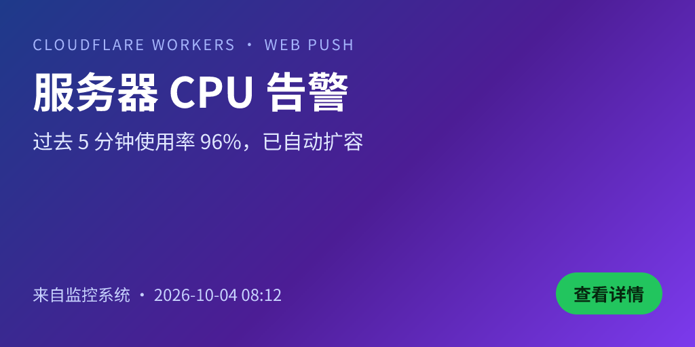

# PingCard

> 部署在 Cloudflare 上的轻量级浏览器推送通知系统。
> Web Push + VAPID 直连浏览器，不需要 Firebase / OneSignal 等第三方推送服务；
> 通知大图由 Worker 内的 `satori` + `@resvg/resvg-wasm` 用 HTML 模板**实时渲染成 PNG**。

<p align="center">
  
  <br>
  <sub>上面这张图就是 <code>/api/card-image</code> 在本项目里真实渲染出来的（模板 + 变量 → PNG）</sub>
</p>

---

## 目录

- [1. 功能概览](#1-功能概览)
- [2. 目录结构](#2-目录结构)
- [3. 本地开发](#3-本地开发)
- [4. 部署到 Cloudflare Pages](#4-部署到-cloudflare-pages)
- [5. 环境变量与密钥](#5-环境变量与密钥)
- [6. 中文字体](#6-中文字体)
- [7. API 参考](#7-api-参考)
- [8. curl 调用示例](#8-curl-调用示例)
- [9. 模板编写指南](#9-模板编写指南)
- [10. 依赖选型、Workers 兼容性与 FCM 说明](#10-依赖选型与-workers-兼容性验证)
- [11. 测试](#11-测试)
- [12. 已知限制](#12-已知限制)
- [13. 验收标准对照](#13-验收标准对照)
- [14. 排错](#14-排错)

---

## 1. 功能概览

| 模块 | 说明 |
|---|---|
| 通知设置页 `/` | 自动生成 / 自定义 User ID（可复制），一键开启或关闭通知，显示该 ID 下的设备数 |
| Service Worker `/sw.js` | 监听 `push` / `notificationclick` / `pushsubscriptionchange`，支持 `actions` 分支与点击跳转 |
| `POST /api/subscribe` | 按 `endpoint` 幂等写入订阅（重复点击「开启通知」不会产生重复记录） |
| `POST /api/unsubscribe` | 删除该设备的订阅记录（关闭通知后不再收到推送） |
| `GET  /api/status` | 查询某 User ID 下的设备数与脱敏后的设备信息 |
| `POST /api/notify` | **核心接口**：广播或定向推送；支持静态图或「模板 + 变量」动态渲染；自动清理 404/410 失效订阅；写入 `notify_logs` |
| `GET  /api/card-image` | 签名（HMAC-SHA256 + 5 分钟时效）或管理员会话校验后渲染 PNG，并用 Cache API 缓存 |
| `/admin/templates` | 模板管理后台：列表 / 编辑 / 实时预览 / 变量面板 / 设为默认 / 删除保护 / 运行环境自检 |
| `GET  /api/users` | 管理接口：列出所有 User ID 及其设备数 |

数据模型见 [`schema.sql`](schema.sql)：`subscriptions` / `templates` / `notify_logs`。

---

## 2. 目录结构

```
pingcard/
├── public/                       # 静态资源（Pages 的 build output）
│   ├── index.html                # 通知设置页
│   ├── app.js                    # 设置页逻辑（原生 JS）
│   ├── sw.js                     # Service Worker
│   ├── manifest.webmanifest      # PWA 清单（iOS 需要）
│   ├── admin/
│   │   ├── templates.html        # 模板管理后台
│   │   └── admin.js
│   ├── icons/                    # 默认 icon / badge / favicon（由脚本生成）
│   └── fonts/                    # 中文字体子集（由脚本生成，同时供 ASSETS 回退加载）
├── functions/                    # Pages Functions 后端
│   ├── api/
│   │   ├── config.js  subscribe.js  unsubscribe.js  status.js
│   │   ├── notify.js  card-image.js  users.js
│   │   └── admin/
│   │       ├── session.js  checklist.js  preview.js  render-check.js
│   │       └── templates/index.js  templates/[id].js  templates/[id]/set-default.js
│   └── _lib/
│       ├── webpush.js            # RFC 8030/8188/8291/8292，纯 Web Crypto 实现
│       ├── renderCard.js         # satori-html → satori → resvg-wasm → PNG
│       ├── templateEngine.js     # {{变量}} / {{变量|默认值}} 替换 + 模板静态检查
│       ├── sign.js               # HMAC 签名 / 校验 / 缓存键
│       ├── auth.js  db.js  http.js  errors.js  bytes.js  urls.js  fonts.js
│       └── fonts/*.bin           # 字体（.bin 由 wrangler 默认规则映射为 Data 模块）
├── scripts/                      # build:fonts / vapid:keys / icons / smoke
├── test/unit.test.mjs            # 单元测试（node --test）
├── schema.sql                    # D1 建表 + 内置示例模板
├── wrangler.toml
└── README.md
```

---

## 3. 本地开发

```bash
git clone https://github.com/Synora9768/PingCard.git && cd PingCard
npm install

# 1) 生成中文字体子集（首次必须执行；产物已提交，改动模板字体时需要重跑）
npm run build:fonts

# 2) 生成本地图标（产物已提交）
npm run icons

# 3) 生成本地开发用的 VAPID 密钥对，写入 .dev.vars
node scripts/vapid-keys.mjs --json > /tmp/vapid.json

# 4) 初始化本地 D1（含内置示例模板 t_demo）
npm run db:local

# 5) 启动
npm run dev          # = wrangler pages dev public  → http://127.0.0.1:8787
```

`.dev.vars`（本地专用，已被 `.gitignore` 忽略）：

```dotenv
VAPID_PUBLIC_KEY=BEl62iUYgUivxIkv69yViEuiBIa-...
VAPID_PRIVATE_KEY=csZzXR9aAr_R-vf1nkndZYHJm9cUmQUctS3Lxmhu550
VAPID_SUBJECT=mailto:you@example.com
NOTIFY_SECRET=dev-notify-secret-please-change-0123456789
ADMIN_SECRET=dev-admin-secret-please-change-0123456789
DEFAULT_ICON_URL=/icons/icon-192.png
DEFAULT_BADGE_URL=/icons/badge-72.png
```

> **注意**：`wrangler pages dev` 的 Web Push 订阅功能需要 HTTPS / `localhost` 环境；
> 本地用 `http://127.0.0.1:8787` 即可（Chrome 允许 localhost 使用 Service Worker）。
> 真机测试请用 `npx wrangler pages dev public --ip 0.0.0.0` 配合内网穿透或直接部署到 Pages。

---

## 4. 部署到 Cloudflare Pages

### 4.1 创建 D1 并初始化

```bash
# 创建数据库（输出里的 database_id 填到 wrangler.toml）
npx wrangler d1 create pingcard
# 或者自动写回 wrangler.toml：
npx wrangler d1 create pingcard --update-config

# 建表（--remote 作用于线上库；内置示例模板 t_demo 会一并写入）
npm run db:remote
```

### 4.2 部署

```bash
npm run deploy        # = wrangler pages deploy public
# 首次会提示创建项目，项目名建议：pingcard
```

绑定 D1：Pages 项目 → Settings → Functions → D1 database bindings → 变量名 **`DB`** 选择 `pingcard`。
若通过 Git 集成自动构建，请在 Pages 项目的 *Settings → Build* 中设置：

- Build command: `npm run build:fonts`（生成字体；若仓库已包含 `functions/_lib/fonts/*.bin` 可留空）
- Build output directory: `public`

> **重要**：字体 `.bin` 必须随 Functions 一起打包（见 [第 6 节](#6-中文字体)）。
> 如果用 Git 集成构建，请确保 `functions/_lib/fonts/*.bin` 已提交到仓库，否则后台预览和推送大图会返回 500。

### 4.3 用 Git 集成时的 `.wrangler` 无关说明

`wrangler.toml` 中的 `database_id` 必须是真实 ID（默认值是占位符 `00000000-...`）。
Pages 项目里配置的 D1 binding 会覆盖 `wrangler.toml` 中的同名绑定。

---

## 5. 环境变量与密钥

生产环境请使用 secret（不要写进 `wrangler.toml`）：

```bash
npx wrangler pages secret put VAPID_PUBLIC_KEY  --project-name pingcard
npx wrangler pages secret put VAPID_PRIVATE_KEY --project-name pingcard
npx wrangler pages secret put VAPID_SUBJECT     --project-name pingcard   # mailto:you@example.com
npx wrangler pages secret put NOTIFY_SECRET     --project-name pingcard   # 保护 /api/notify 与卡片签名
npx wrangler pages secret put ADMIN_SECRET       --project-name pingcard   # 保护 /api/admin/* 与 /api/users
```

| 变量 | 必填 | 说明 |
|---|---|---|
| `VAPID_PUBLIC_KEY` | ✅ | 65 字节未压缩 P-256 点的 base64url；前端订阅时作为 `applicationServerKey` |
| `VAPID_PRIVATE_KEY` | ✅ | 32 字节标量的 base64url（也接受 PKCS#8/SEC1 PEM 或 JWK JSON），**仅后端使用** |
| `VAPID_SUBJECT` | ✅ | 形如 `mailto:you@example.com`，Web Push 规范要求 |
| `NOTIFY_SECRET` | ✅ | `/api/notify` 的 Bearer Token，同时是 `/api/card-image` 的签名密钥 |
| `ADMIN_SECRET` | ✅ | 后台登录口令，用于换取 12 小时有效的会话 Cookie |
| `DEFAULT_ICON_URL` | ⬜ | 通知小图标，默认 `/icons/icon-192.png` |
| `DEFAULT_BADGE_URL` | ⬜ | 状态栏角标（单色透明 PNG），默认 `/icons/badge-72.png` |

### 生成 VAPID 密钥对

```bash
npm run vapid:keys
# VAPID_PUBLIC_KEY=BInw...
# VAPID_PRIVATE_KEY=csZz...
```

生成逻辑基于 Node 内置 `crypto`，输出格式与 `web-push` 官方 CLI 完全一致（base64url），
因此可以与其他推送工具互通。其它可用参数：

```bash
npm run vapid:keys -- --json                       # JSON 输出（便于脚本消费）
npm run vapid:keys -- --from-private <PRIVATE_KEY> # 由私钥反推公钥（PEM / JWK / base64url 均可）
```

> 密钥轮换：更换 VAPID 密钥对会让**已有订阅全部失效**（浏览器上的订阅绑定原公钥），
> 用户需要重新点击「开启通知」。因此请把密钥妥善保存。

### 管理员登录方式

| 场景 | 方式 |
|---|---|
| 后台页面 | 打开 `/admin/templates`，输入 `ADMIN_SECRET`，换取 `pc_admin` 会话 Cookie（12 小时） |
| curl / 脚本 | 头部 `X-Admin-Secret: <ADMIN_SECRET>` 或 `Authorization: Bearer <ADMIN_SECRET>` |

Cookie 签名由 `ADMIN_SECRET` 派生（HMAC），过期后需重新登录；所有密钥比较均为哈希后定长时间比较。

---

## 6. 中文字体

**为什么需要**：`satori` 不做字体回退，必须显式传入字体文件，否则中文渲染为空白/方块。

**做法**：把 Noto Sans SC 裁剪成子集，使 Worker 包体积可控。

```bash
npm run build:fonts
# · subset charset: 5286 characters (3755 CJK ideographs)
# ✓ NotoSansSC-Regular.subset.woff — 827 KiB → functions/_lib/fonts/NotoSansSC-Regular.bin
# ✓ NotoSansSC-Bold.subset.woff    — 839 KiB → functions/_lib/fonts/NotoSansSC-Bold.bin
```

产物与用途：

| 路径 | 用途 |
|---|---|
| `functions/_lib/fonts/NotoSansSC-*.bin` | **渲染用**。Pages Functions 无法使用自定义 esbuild `[[rules]]`，但 wrangler 的默认规则会把 `**/*.bin` 映射为 `Data`（`ArrayBuffer`）模块，代码里直接 `import` 即可，零运行时网络开销 |
| `public/fonts/NotoSansSC-*.subset.woff` | 静态回退资源。当 `.bin` 缺失时，`_lib/fonts.js` 会通过 `env.ASSETS` 读取它，保证另一套打包方式也能工作；同时它可以直接被浏览器 `<link rel=preload>` 使用 |
| `OFL.txt` | Noto Sans SC 的授权（SIL OFL-1.1），随字体一起分发 |

**字体来源**：`scripts/build-fonts.mjs` 通过 npm 包 `@expo-google-fonts/noto-sans-sc` 获取 Google Fonts 官方 Noto Sans SC 静态 TTF（10.5 MB/字重），
再用 `subset-font`（harfbuzz 的 wasm 构建）裁剪为 **GB2312 一级字库（3755 个最常用简体字）+ ASCII + 拉丁 + 常用标点/符号**。
若已有本地字体文件，可指定目录跳过下载：

```bash
FONT_SRC_DIR=/path/to/fonts npm run build:fonts   # 需包含 NotoSansSC_400Regular.ttf / NotoSansSC_700Bold.ttf
```

**如需渲染生僻字**：把 `scripts/build-fonts.mjs` 的 `buildCharSet()` 改为包含完整 CJK 区块
（体积会涨到 ~2.5 MiB/字重，需自行评估 Pages Functions 包体积限制），或准备按需裁剪的字体文件。

---

## 7. API 参考

| 方法 | 路径 | 鉴权 | 说明 |
|---|---|---|---|
| GET | `/api/config` | — | 前端配置：VAPID 公钥、默认图标、User ID 规则 |
| POST | `/api/subscribe` | — | `{ userId, subscription, userAgent? }`，按 `endpoint` upsert |
| POST | `/api/unsubscribe` | — | `{ userId, endpoint }`，删除记录 |
| GET | `/api/status?userId=` | — | `{ userId, deviceCount, subscriptions[] }`（endpoint 仅返回指纹） |
| POST | `/api/notify` | `Bearer NOTIFY_SECRET` | 见下 |
| GET | `/api/card-image` | `sig`+`ts` 或管理员会话 | 渲染 PNG |
| GET | `/api/users` | `ADMIN_SECRET` | `{ count, totalActiveDevices, users[] }` |
| GET | `/api/admin/checklist` | `ADMIN_SECRET` | 13 项部署自检（配置 / D1 / 渲染 / 签名） |
| POST | `/api/admin/render-check` | `ADMIN_SECRET` | 保存前校验未保存的模板 |
| POST | `/api/admin/preview` | `ADMIN_SECRET` | 未保存模板 → PNG（后台实时预览） |
| GET/POST | `/api/admin/templates` | `ADMIN_SECRET` | 列表 / 新建 |
| GET/PUT/DELETE | `/api/admin/templates/:id` | `ADMIN_SECRET` | 详情 / 更新 / 删除（删除有边界保护） |
| POST | `/api/admin/templates/:id/set-default` | `ADMIN_SECRET` | 设为唯一默认模板 |
| POST/GET/DELETE | `/api/admin/session` | — | 登录 / 检查 / 退出 |

### `POST /api/notify` 请求体

```jsonc
{
  "userId": "zhangsan",          // 可选，指定则定向推送；不填 = 广播给所有 is_active=1 的订阅
  "templateId": "t_demo",        // 可选，不传则使用 is_default=1 的模板
  "variables": {                 // 模板占位符的取值
    "title": "服务器告警",
    "body": "CPU 使用率超过 90%",
    "bgImage": "https://example.com/bg.jpg"
  },
  "image": "https://…/static.png", // 可选：直接给静态大图，跳过模板渲染（优先级高于 templateId）
  "icon": "https://…/i.png",       // 可选，默认取 DEFAULT_ICON_URL
  "badge": "https://…/b.png",      // 可选，默认取 DEFAULT_BADGE_URL
  "url": "https://example.com/x",  // 可选，点击跳转地址，默认首页
  "actions": ["open", "dismiss"],  // 可选：预设字符串或 { action, title, icon } 对象（最多 2 个）
  "title": "通知标题",              // 可选：覆盖通知标题（默认取变量 title / 模板名）
  "body": "通知正文",               // 可选：覆盖通知正文（默认取变量 body / description）
  "ttl": 604800,                   // 可选：推送有效期（秒）
  "dryRun": true,                  // 可选：只做校验与签名，不真正发送（便于联调）
  "debug": true                    // 可选：响应中附带每台设备的失败原因
}
```

响应：`{ success, sent, failed, cleaned, total, templateId, imageUrl }`

处理顺序（与需求文档 §4.3 一致）：

1. 有 `image` → 直接用；否则取 `templateId`（或默认模板）+ `variables` → 生成带签名的 `/api/card-image` 链接
2. 按 `userId` 查询订阅（为空则全部活跃订阅）
3. 逐条用 Web Push（VAPID）加密发送（每批 20 条并发）
4. 推送服务返回 **404 / 410** 时自动删除该订阅记录并计入 `cleaned`
5. 写入 `notify_logs`

### `GET /api/card-image` 参数

| 参数 | 说明 |
|---|---|
| `templateId` | 模板 ID；省略时使用默认模板 |
| `variables` | URL 编码的 JSON 对象 |
| `ts` | 签名时间戳（秒），**5 分钟**内有效 |
| `sig` | HMAC-SHA256(`templateId + 规范化 variables + ts`, `NOTIFY_SECRET`) 的 base64url |
| `fresh=1` | 仅管理员：跳过缓存强制重渲染 |
| `w`/`h` | 仅管理员：覆盖输出尺寸（普通签名请求固定使用模板尺寸，防止改尺寸绕过缓存） |

响应头：`x-pingcard-cache: HIT|MISS`、`x-pingcard-render-ms`、`x-pingcard-size`、`x-pingcard-template`、`x-pingcard-verified-by`。

> 签名只由 `/api/notify` 内部生成，调用方无需也不应感知算法；重复的参数（如两个 `variables`）会被直接拒绝，
> 避免不同解析层取值不一致带来的歧义。

---

## 8. curl 调用示例

设：

```bash
export BASE="https://pingcard.pages.dev"          # 本地开发用 http://127.0.0.1:8787
export NOTIFY_SECRET="你的 NOTIFY_SECRET"
export ADMIN_SECRET="你的 ADMIN_SECRET"
export USER_ID="zhangsan"
```

### 8.1 订阅接口测试

```bash
# 查看前端配置（VAPID 公钥等）
curl -s "$BASE/api/config" | jq

# 写入一条订阅（endpoint/keys 来自浏览器的 subscription.toJSON()）
curl -s -X POST "$BASE/api/subscribe" \
  -H 'content-type: application/json' \
  -d '{
    "userId": "'"$USER_ID"'",
    "userAgent": "curl/8",
    "subscription": {
      "endpoint": "https://fcm.googleapis.com/fcm/send/xxxxx",
      "keys": { "p256dh": "BEl6...", "auth": "k3J9..." }
    }
  }' | jq
# → { "success": true, "userId": "zhangsan", "deviceCount": 1, "message": "Subscription stored" }

# 重复提交同一个 endpoint 不会产生重复记录（幂等）
# 查询设备数
curl -s "$BASE/api/status?userId=$USER_ID" | jq

# 删除订阅
curl -s -X POST "$BASE/api/unsubscribe" \
  -H 'content-type: application/json' \
  -d '{"userId":"'"$USER_ID"'","endpoint":"https://fcm.googleapis.com/fcm/send/xxxxx"}' | jq
```

### 8.2 静态图推送（跳过模板渲染）

```bash
curl -s -X POST "$BASE/api/notify" \
  -H "Authorization: Bearer $NOTIFY_SECRET" \
  -H 'content-type: application/json' \
  -d '{
    "userId": "'"$USER_ID"'",
    "image": "https://picsum.photos/1024/512",
    "icon":  "https://picsum.photos/192",
    "url":   "https://example.com/status",
    "actions": ["open", "dismiss"],
    "variables": { "title": "静态图通知", "body": "未使用模板渲染" }
  }' | jq
# → { "success": true, "sent": 1, "failed": 0, "cleaned": 0, "total": 1, ... }
```

### 8.3 模板 + 变量动态渲染推送

```bash
curl -s -X POST "$BASE/api/notify" \
  -H "Authorization: Bearer $NOTIFY_SECRET" \
  -H 'content-type: application/json' \
  -d '{
    "userId": "'"$USER_ID"'",
    "templateId": "t_demo",
    "variables": {
      "title":  "服务器告警",
      "body":   "CPU 使用率超过 90%",
      "footer": "来自监控系统",
      "cta":    "查看详情"
    },
    "url": "https://example.com/alerts/42"
  }' | jq
# → imageUrl 是带签名的 /api/card-image 链接，通知里的大图就是它

# 不指定 templateId → 自动使用“设为默认”的模板
curl -s -X POST "$BASE/api/notify" \
  -H "Authorization: Bearer $NOTIFY_SECRET" \
  -H 'content-type: application/json' \
  -d '{"variables":{"title":"广播测试","body":"给所有活跃订阅者"}}' | jq

# 联调推荐：先 dryRun 看解析结果与签名链接（不会真的推送）
curl -s -X POST "$BASE/api/notify" \
  -H "Authorization: Bearer $NOTIFY_SECRET" \
  -H 'content-type: application/json' \
  -d '{"userId":"'"$USER_ID"'","templateId":"t_demo",
       "variables":{"title":"预览","body":"dry run"},"dryRun":true}' | jq '.imageUrl'

# 直接抓取渲染结果
curl -s -o card.png "$(上面输出的 imageUrl)" && file card.png   # PNG image data, 1024 x 512
```

无鉴权调用必须返回 401：

```bash
curl -s -o /dev/null -w '%{http_code}\n' -X POST "$BASE/api/notify" \
  -H 'content-type: application/json' -d '{}'      # → 401
```

### 8.4 模板管理接口增删改查

```bash
AUTH=(-H "X-Admin-Secret: $ADMIN_SECRET" -H 'content-type: application/json')

# 1) 列表
curl -s "${AUTH[@]}" "$BASE/api/admin/templates" | jq '.templates[] | {id, name, isDefault}'

# 2) 新建
curl -s "${AUTH[@]}" -X POST "$BASE/api/admin/templates" -d '{
  "id": "t_alert",
  "name": "告警卡片",
  "width": 1024,
  "height": 512,
  "variablesSchema": {
    "title":   { "type": "string",    "required": true,  "label": "标题" },
    "body":    { "type": "string",    "required": true,  "label": "正文" },
    "bgImage": { "type": "image_url", "required": false, "label": "背景图" },
    "footer":  { "type": "string",    "required": false, "label": "底部文字", "default": "来自系统通知" }
  },
  "htmlTemplate": "<div style=\"display:flex;flex-direction:column;width:1024px;height:512px;padding:56px;justify-content:space-between;background-color:#0f172a;font-family:Noto Sans SC\"><div style=\"display:flex;flex-direction:column\"><div style=\"display:flex;font-size:24px;color:#93c5fd\">{{footer}}</div><div style=\"display:flex;font-size:60px;font-weight:700;color:#fff;margin-top:16px\">{{title}}</div><div style=\"display:flex;font-size:30px;color:#e2e8f0;margin-top:14px\">{{body}}</div></div><div style=\"display:flex;font-size:22px;color:#cbd5e1\">{{bgImage}}</div></div>"
}' | jq '.template.id, .warnings'
# 保存前会做静态检查 + 真实渲染；不支持的写法返回 422 与中文错误说明

# 3) 详情 / 更新
curl -s "${AUTH[@]}" "$BASE/api/admin/templates/t_alert" | jq '.template.name'
curl -s "${AUTH[@]}" -X PUT "$BASE/api/admin/templates/t_alert" \
  -d '{"name":"告警卡片 v2"}' | jq '.template.name'

# 4) 设为默认（/api/notify 不传 templateId 时使用）
curl -s "${AUTH[@]}" -X POST "$BASE/api/admin/templates/t_alert/set-default" | jq

# 5) 保存前校验未保存的模板内容
curl -s "${AUTH[@]}" -X POST "$BASE/api/admin/render-check" \
  -d '{"htmlTemplate":"<div style=\"display:flex\">{{title}}</div>",
       "variablesSchema":{"title":{"type":"string","required":true}}}' | jq '{ok, errors, renderMs}'

# 6) 删除（若为唯一默认模板会返回 409 拒绝）
curl -s "${AUTH[@]}" -X DELETE "$BASE/api/admin/templates/t_alert" | jq

# 7) 其它管理接口
curl -s "${AUTH[@]}" "$BASE/api/users" | jq
curl -s "${AUTH[@]}" "$BASE/api/admin/checklist" | jq '{ok, summary, checks: [.checks[] | {label, status}]}'
```

### 8.5 管理员会话（Cookie 方式）

```bash
# 登录并把 Cookie 存到 jar 文件
curl -s -c cookies.txt -X POST "$BASE/api/admin/session" \
  -H 'content-type: application/json' -d '{"secret":"'"$ADMIN_SECRET"'"}' | jq
# 之后可直接带 Cookie 访问（后台页面也是这么做的）
curl -s -b cookies.txt "$BASE/api/admin/templates" | jq '.templates | length'
curl -s -b cookies.txt -X DELETE "$BASE/api/admin/session" | jq   # 退出
```

---

## 9. 模板编写指南

### 9.1 占位符语法

| 写法 | 行为 |
|---|---|
| `{{变量名}}` | 替换为 `variables` 中对应的值 |
| `{{变量名\|默认值}}` | `variables` 未提供该值时使用默认值（默认值中**不要**包含引号，见下） |

- 变量名：字母 / 数字 / `_` / `.` / `-`，最长 64 字符
- 变量解析顺序：`variables_schema` 的 `default` → 请求体 `variables` 的值 → 占位符内的 `|默认值` → 空字符串
- `variables_schema` 里 `required: true` 的变量缺失时，`/api/notify` 返回 `400`

### 9.2 安全：变量替换为什么是安全的

替换发生在**两个层面**，都不会破坏模板结构：

1. **属性值预替换**（`substituteInAttributes`）：`style="color:{{c}}"` 这类占位符必须在 HTML 解析前替换，
   否则 `satori-html` 会因为值不是合法 CSS 而丢弃整条声明。替换时只改引号**内部**的文本，
   并把值里出现的引号剥掉，因此变量无法提前闭合属性、也无法新增属性。
2. **节点树替换**（`substituteVariables`）：其余占位符在 HTML 解析成节点树**之后**才对文本节点 / CSS 属性赋值。
   变量值此时只是一段字符串，不存在「被 HTML 解析」的机会，所以
   `<script>`、`{{其它变量}}`、`"; } body { …` 之类的内容都只会作为字面文本渲染出来。

> 注意：这里**不使用 HTML 实体转义**（`&lt;` 等）。`satori-html` 不解码实体，
> 转义后的字符会原样出现在 PNG 里，并且会破坏 `url('...')` 里的真实地址。
> 结构惰性由上面的两层替换保证，而不是靠转义。

2. 「变量」类字段的类型校验：`variables_schema` 中 `type: "image_url"` 的变量会强制校验为
   `http/https`（或 `data:image/...`）并拒绝内网地址（SSRF 防护：`localhost`、`10.0.0.0/8`、
   `172.16.0.0/12`、`192.168.0.0/16`、`169.254.0.0/16`、`::1`、`fc00::/7` 等）。

### 9.3 satori 支持的 CSS 子集

| ✅ 支持 | ❌ 不支持 |
|---|---|
| `display: flex / none / contents` | `grid`、`<table>`、`float` |
| `flex-direction`、`flex-wrap`、`flex-grow/shrink/basis`、`gap` | 伪类 / 伪元素（`:hover`、`::before`…） |
| `justify-content`、`align-items`、`align-self`、`align-content` | CSS 动画 / 过渡（`animation`、`transition`） |
| `width`/`height`/`min-*`/`max-*`、`padding`、`margin`、`border`、`border-radius` | `position: fixed` / `sticky`（只支持 `absolute`、`relative`、`static`） |
| `background-color`、`background-image`（含 `linear-gradient`）、`background-size`、`background-position` | 外部样式表、`<style>` 标签、`class` 选择器（**必须内联 `style`**） |
| `color`、`font-size`、`font-weight`、`font-family`、`line-height`、`letter-spacing`、`text-align`、`text-transform` | JavaScript（模板内不执行任何脚本，`on*` 属性会被拒绝） |
| `opacity`、`transform`、`box-shadow`、`text-shadow`、`overflow: hidden` | `position: fixed`、`z-index` 的复杂层叠、多列布局 |

其它注意事项：

- 卡片尺寸以模板的 `width` / `height` 为准（默认 1024×512，2:1 是浏览器通知大图的最佳比例）
- 容器有多于一个子节点时**必须**写 `display: flex`，否则 satori 抛
  `Expected <div> to have explicit "display: flex" …`
- `` 必须给 `width` / `height`（远程图片可能拿不到尺寸，会渲染失败）
- 模板中至少要有 1 个占位符，否则保存会被拒绝（此时应直接使用静态 `image` 推送）
- **引号不要包住 `{{ }}`**：`url('{{bg|https://x/y.png'}})` 会让 `}}` 永远匹配不到，
  占位符不会被替换。正确写法：`url('{{bg}}')` 或 `url({{bg|https://x/y.png}})`；
  保存时的静态检查会直接报错提示。

### 9.4 后台工作流

1. 打开 `/admin/templates` → 输入 `ADMIN_SECRET` 登录（12 小时有效）
2. 「新建模板」或点选已有模板 → 左侧编辑 HTML，右侧自动生成变量测试面板
   （来自 `variables_schema`；未配置则按模板里检测到的占位符生成）
3. 底部「实时预览」调用 `POST /api/admin/preview`（会话鉴权，无需签名），
   所见即所得；也可以点「解析检查」看具体报错
4. 保存时后端会**静态检查 + 真实渲染一遍**，失败返回 `422` 与中文说明（例如「不支持的标签: &lt;table&gt;」）
5. 「设为默认模板」→ `/api/notify` 不传 `templateId` 时使用它
6. 「删除模板」有二次确认；若要删除的是唯一默认模板，服务端返回 `409` 拒绝
7. 顶部「运行环境自检」一次性检查密钥、D1、字体、渲染链路、签名逻辑

---

## 10. 依赖选型与 Workers 兼容性验证

### 10.1 结论速览

| 能力 | 选型 | Workers 兼容性 |
|---|---|---|
| Web Push 加密 | **自研**（`functions/_lib/webpush.js`，纯 Web Crypto） | ✅ 已在 workerd 实测 |
| VAPID JWT | 自研 ES256（Web Crypto ECDSA） | ✅ |
| HTML → 节点树 | `satori-html@0.3.2` | ✅ |
| 节点树 → SVG | **`@cf-wasm/satori@0.4.2`**（satori 的 Workers 移植，内置 satori 0.32.0） | ✅ |
| SVG → PNG | `@resvg/resvg-wasm@2.6.2`（wasm 作为 `CompiledWasm` 模块导入） | ✅ |
| 字体子集裁剪 | `subset-font@2.9.0`（构建期，Node） | ✅（构建脚本，非运行时） |
| 加密互操作验证 | `http_ece@1.2.1`（**仅测试用 devDependency**） | ✅（Node 测试环境） |

### 10.2 为什么不用 `web-push` npm 包

`web-push` 依赖 Node 的 `crypto`、`https`、`http` 等模块与流式 API，
在 V8 isolate 中没有对应的完整实现；把 `nodejs_compat` 打开也**不等于**任意 npm 包可用
（这正是不应假设的地方）。因此本项目按 RFC 8030/8188/8291/8292 自行实现：

- 密钥协商：`crypto.subtle.deriveBits({ name: 'ECDH' }, …)`
- 密钥派生：HKDF-SHA256（`WebPush: info` / `content-encoding` / `nonce` 三段 info，与规范一致）
- 内容加密：AES-128-GCM，产出标准 `aes128gcm` 单记录体（`salt(16) | rs(4) | idlen(1) | keyid(65) | ciphertext+tag`）
- VAPID：ES256 JWT（Web Crypto 的 ECDSA 直接输出 IEEE-P1363 `r||s`，正是 JWS 需要的格式）
- 请求头：`Authorization: vapid t=…, k=…`、`TTL`、`Urgency`、`Content-Encoding: aes128gcm`

`payload` 上限 4096 字节（与规范建议一致），超限返回 `413`。

**正确性如何证明**：单元测试固定密钥与 salt，把我们的输出和 `http_ece`（RFC 8188/8291 的参考实现，
作者即 RFC 作者）的输出做**逐字节比对**，并让 `http_ece` 解密我们生成的记录：

```
ok 18 - our aes128gcm record is byte-identical to the reference implementation
ok 19 - the reference implementation decrypts what we encrypt (interop)
ok 20 - a subscriber can decrypt what we send (full round trip)
ok 21 - VAPID authorization header carries a verifiable ES256 JWT   # 用公钥验签通过
```

`http_ece` 只作为 **devDependency** 存在于测试中（它依赖 Node `crypto`），生产代码不含任何 Node 依赖。

> 这轮验证确实抓到过一个真实缺陷：最初使用的 info 字符串是早期草案的
> `WebPush: content-encodings\0` / `WebPush: nonce\0`，而 RFC 8291 §3.4 最终版是
> `Content-Encoding: aes128gcm\0` / `Content-Encoding: nonce\0`。
> 用错的话推送服务会直接以 400/401 拒绝（或浏览器解不开），这正是"加密实现必须做互操作验证"的原因。

### 10.3 为什么不用官方 `satori` 包

`satori ≥ 0.33` 依赖 `harfbuzzjs`，而 `harfbuzzjs` 的胶水代码里有 `require("fs")`，
在 Pages Functions 打包时会直接失败：

```
✘ [ERROR] Could not resolve "fs"
    node_modules/harfbuzzjs/hb.js:1:820:
    … if (ENVIRONMENT_IS_NODE){var fs=require("fs");
    The package "fs" wasn't found on the file system but is built into node.
    - Add the "nodejs_compat" compatibility flag to your project.
```

（`nodejs_compat` 只是把报错变成运行期风险，并不能让 harfbuzz 的 wasm 装载路径在 isolate 里工作。）

`@cf-wasm/satori` 做了三件关键的事：把 satori 固定在不依赖 harfbuzzjs 的 **0.32.0**、
预初始化 yoga-layout 的 wasm（`import yogaWasmModule from './lib/yoga.wasm'`）、
并提供 `workerd` 条件导出（`exports["./workerd"]`），因此在 Pages Functions 里开箱即用。

### 10.4 字体如何进入 Worker

Cloudflare Pages 的 `buildFunctions()` 只从 `functions/` 目录构建 Worker，
**不会**把 `wrangler.toml` 里的自定义 `[[rules]]` 传给 esbuild（已核对 wrangler 4.147.0 源码）。
但它会应用 wrangler 的**默认**模块规则：

```js
DEFAULT_MODULE_RULES = [
  { type: 'Text',          globs: ['**/*.txt', '**/*.html', '**/*.sql'] },
  { type: 'Data',          globs: ['**/*.bin'] },
  { type: 'CompiledWasm',  globs: ['**/*.wasm'] },
];
```

所以字体以 `.bin` 形式放在 `functions/_lib/fonts/` 下，被映射为 `ArrayBuffer` 模块；
`_lib/fonts.js` 优先使用它，失败时回退到 `env.ASSETS` 读取 `public/fonts/*.woff`。

### 10.5 需要单独「对接 FCM」吗？

**不需要。** Chrome / Edge（Android 与桌面）订阅时会返回一个
`https://fcm.googleapis.com/fcm/send/…` 的 endpoint，FCM 在这里扮演的是**推送服务（push service）**的角色，
而我们作为**应用服务器**只需按标准 Web Push 协议往这个 endpoint POST。因此：

- ❌ 不需要 Firebase 项目、`google-services.json`、FCM server key / legacy HTTP API
- ❌ 不需要 Firebase Admin SDK（那是给原生 App 推消息用的另一套东西）
- ✅ 浏览器把 endpoint 交给我们，我们签名 + 加密后 POST 过去即可（本仓库的 `_lib/webpush.js`）

FCM 对 Web Push 请求的硬性要求，本实现逐条满足（可用 `npm run smoke` / `node -e` 复现请求头）：

| FCM 的要求 | 本实现 |
|---|---|
| `Authorization: vapid t=<JWT>, k=<公钥>` | ✅ `_lib/webpush.js#vapidAuthorizationHeader` |
| JWT `aud` 必须等于 endpoint 的 origin（`https://fcm.googleapis.com`） | ✅ 由 `new URL(endpoint).origin` 自动推导，无需配置 |
| JWT `exp` ≤ 24 小时 | ✅ 固定 12 小时 |
| `Content-Encoding: aes128gcm` | ✅ |
| 必须有 `TTL` 头 | ✅ 默认 4 周，可用请求体 `ttl` 覆盖 |
| 载荷上限 4096 字节 | ✅ 明文超过 4096 直接返回 `413`；典型载荷（标题+正文+卡片 URL）约 300–1000 字节 |
| 订阅失效返回 `404`/`410` | ✅ 自动删除该订阅记录并计入 `cleaned` |
| 限流/临时故障返回 `429`/`5xx` | ✅ 标记为可重试（`interpretPushResponse().retryable`），不计入 `cleaned` |

在本地验证「发给 FCM 的请求长什么样」（不需要网络，也不需要 FCM 账号）：

```bash
node -e "
import('./functions/_lib/webpush.js').then(async ({ buildPushRequest, parseVapidKeys }) => {
  const ua = await crypto.subtle.generateKey({ name: 'ECDH', namedCurve: 'P-256' }, true, ['deriveBits']);
  const request = await buildPushRequest({
    subscription: {
      endpoint: 'https://fcm.googleapis.com/fcm/send/example-token',
      keys: {
        p256dh: Buffer.from(new Uint8Array(await crypto.subtle.exportKey('raw', ua.publicKey))).toString('base64url'),
        auth: Buffer.alloc(16, 3).toString('base64url'),
      },
    },
    payload: JSON.stringify({ title: 'hi' }),
    vapid: parseVapidKeys({ publicKey: process.env.VAPID_PUBLIC_KEY, privateKey: process.env.VAPID_PRIVATE_KEY, subject: 'mailto:you@example.com' }),
  });
  console.log(request.method, request.url);
  for (const [k, v] of request.headers) console.log(' ', k + ':', v.slice(0, 60));
});"
```

输出中 `authorization` 里的 JWT 解出来是 `{"aud":"https://fcm.googleapis.com", …}` —— 这正是 FCM 校验的字段。
若 FCM 返回 **401/403**，几乎总是 VAPID 公私钥不匹配或 `VAPID_SUBJECT` 不是 `mailto:`/`https://`；
本仓库的「运行环境自检」(`GET /api/admin/checklist`) 会先把这两个问题挡在前面。

### 10.6 实测数据（`wrangler pages dev`，本机）

| 项目 | 结果 |
|---|---|
| `initWasm(resvg)` 首次初始化 | ~1 ms |
| satori 渲染 1024×512 中文模板 | 90–500 ms（冷启动首次更慢，之后稳定在 ~100 ms 量级） |
| resvg SVG → PNG（1024×512） | ~140 ms |
| 缓存命中（Cache API） | `x-pingcard-cache: HIT`，`x-pingcard-render-ms: 0` |
| Web Crypto（ECDH + HKDF + AES-GCM + ECDSA） | 全部可用；P-256 公钥 65 字节、JWS 签名 64 字节 |
| 本仓库 smoke 测试 | 61/61 通过（含真实 D1、签名、缓存、模板 CRUD） |

复现方式：`npm run smoke`（详见下一节）。

---

## 11. 测试

```bash
npm test      # 21 项单元测试（node --test）
npm run smoke # 63 项端到端断言：真实启动 wrangler pages dev + 本地 D1
```

`npm test` 覆盖：

| 分组 | 内容 |
|---|---|
| 模板引擎 | 占位符/默认值、恶意值（`<script>`、`{{…}}`、引号）不产生结构注入、CSS 值替换、属性替换边界 |
| 签名 | 生成/校验/篡改拒绝/过期拒绝、规范化与缓存键（含模板版本失效）、base64url、定长时间比较 |
| 安全 | SSRF 黑名单（内网/回环/云元数据）、非法 URL 拒绝 |
| Web Push | **与 `http_ece` 参考实现逐字节一致**、双向互操作、订阅端解密、记录结构（rs/idlen/delimiter）、VAPID JWT 用公钥验签 |
| 模板检查 | 不支持标签、无占位符、`position: fixed` 等 lint 规则 |

`npm run verify:live` 对**已部署的线上环境**做一次只读验收（不写订阅、不改模板、不真正发送推送），
适合上线后随时自证，也适合把「推送链路是否正常」交给非开发者执行：

```bash
BASE=https://pingcard.pages.dev \
NOTIFY_SECRET=xxx ADMIN_SECRET=yyy USER_ID=zhangsan \
npm run verify:live

# 或显式传参
npm run verify:live -- --base https://pingcard.pages.dev \
  --notify-secret "$NOTIFY_SECRET" --admin-secret "$ADMIN_SECRET" --user zhangsan
```

检查项（23 项）：站点与 SW/字体可用、`/api/config` 的 VAPID 公钥是合法 P-256 点、
`/api/notify` 与 `/api/card-image`、`/api/users` 对未授权请求分别返回 401/403、
管理员 13 项自检无 fail、默认模板存在、用 dryRun 走通「签名 → 渲染 PNG → 缓存命中 → 过期签名 403」全过程。
缺少某个 secret 时对应检查会标记为「跳过」而不是失败。

`npm run smoke`（本地，含 D1 写入）覆盖 63 项断言，包括：

- 静态资源与 `/api/config`
- 订阅 / 重复订阅幂等 / 状态查询 / 非法 User ID
- `/api/notify` 未鉴权 401、错误密钥 401
- 模板渲染 → 签名链接 → PNG 尺寸 → Cache `HIT` → 篡改/过期 403 → 重复参数 400
- 管理员登录 / 会话 Cookie / 未鉴权 403 / 自检
- 模板校验（`<table>`、无占位符、`display:grid` 全部 422 并给出中文原因）
- 模板 CRUD、默认模板切换、唯一默认模板删除保护 409
- 取消订阅后不再有推送目标
- `notify_logs` 落库

> `npm run smoke` 使用独立的 `.wrangler/smoke` 持久化目录与临时 `.dev.vars`，
> 不会污染你的开发数据；结束后自动还原。加 `-- --keep` 可保留服务器以便手动调试。

---

## 12. 已知限制

1. **iOS / iPadOS**：Web Push 需要 **iOS 16.4+**，且必须把网站「添加到主屏幕」后从主屏幕图标打开
   （`display: standalone`）。在 Safari 标签页里 `PushManager` 不可用，属于浏览器平台限制，不是代码问题。
   设置页会自动识别并给出对应提示。
2. **通知大图 `image`**：Chrome / Edge（Android 与桌面）支持并渲染为 BigPictureStyle 效果；
   Firefox 会忽略 `image` 字段，部分 Safari 版本支持有限 —— 此时通知退化为「小图标 + 标题 + 正文」。
   卡片本身仍然会被渲染（并缓存），只是不在该平台展示。
3. **通知按钮 `actions`**：仅 Chromium 系（Chrome / Edge）支持，且最多 2 个；
   Safari / Firefox 会忽略，`notificationclick` 中的 `open` / `dismiss` 分支仍可用。
4. **模板 CSS 能力边界**：仅 flexbox 子集（详见 [9.3](#93-satori-支持的-css-子集)）。
   不支持 grid / table / 伪类 / 动画 / `position: fixed` / 外部样式表。
5. **字体子集**：默认只包含 GB2312 一级字库（3755 字）+ 拉丁 + 常用符号；
   非常用汉字（如生僻字、部分繁体字）会显示为空白。需要时按 [第 6 节](#6-中文字体)重新裁剪。
6. **Worker CPU 与包体积**：单张卡片渲染约 0.1–0.5 s CPU；字体约 1.7 MiB 计入 Functions 包体积。
   高频推送建议复用相同变量以命中 Cache API（相同参数的卡片只渲染一次）。
7. **D1 并发**：订阅写入是单条 upsert（`ON CONFLICT(endpoint)`），广播推送的失效清理按 endpoint 逐条删除；
   极大订阅量（数万）下单次 `/api/notify` 可能触及 Worker 请求时限，建议分批调用（同一 `topic` 可覆盖更新）。
8. **本地开发的 Push 测试**：`localhost` 可以完成订阅、签名、渲染、缓存的全链路验证，
   但**最后一步投递**（Worker → FCM/APNs/Mozilla 推送端点）需要 Worker 具备出站网络访问。
   在受限网络（离线环境、只允许 npm 的沙箱、企业代理）里 `POST /api/notify` 会把每台设备记入
   `failed` 并在 `debug: true` 时给出 `fetch failed` 之类的网络原因 —— 这是环境限制，不是实现问题。
   要完成真正的端到端推送，请部署到你自己的 Cloudflare 账号（Workers 可自由出站），
   或在本地用内网穿透 + `wrangler pages dev` 组合调试。
9. **`wrangler pages dev` 不读取自定义 `[[rules]]`**：字体必须走 `.bin` + `env.ASSETS` 回退方案，
   已在 [10.4](#104-字体如何进入-worker) 说明；如果你换用自建打包流程，注意保持这两种途径之一可用。

---

## 13. 验收标准对照

| 验收项 | 实现位置 | 验证 |
|---|---|---|
| 首页可编辑、可复制的 User ID | `public/index.html` + `app.js`（`localStorage`） | smoke §1（页面渲染） |
| 开启通知后 D1 产生订阅记录，重复点击不重复 | `functions/api/subscribe.js`（`ON CONFLICT(endpoint)`） | smoke §2 |
| 不带 `userId` 广播 / 带 `userId` 定向 | `functions/api/notify.js` | smoke §4（`total` 精确匹配目标设备数） |
| 无正确 `Authorization` → `401` | `_lib/auth.js#requireNotifySecret` | smoke §3 |
| 关闭通知后不再收到推送且记录被清理 | `/api/unsubscribe` + `sw.js` | smoke §9 |
| 模板 + 变量渲染出正确 PNG | `_lib/renderCard.js` | smoke §5 + `docs/example-card.png` |
| 中文正常显示（无方块/乱码） | `_lib/fonts.js` + 子集字体 | smoke：checklist `render_pipeline`；`docs/example-card.png` |
| 传入静态 `image` 时跳过模板渲染 | `notify.js` 分支优先级 | smoke §8（`image` 优先） |
| 含 `{{}}` / HTML 特殊字符的变量不破坏渲染 | `_lib/templateEngine.js`（两层惰性替换） | `npm test` + smoke §4（恶意 `cta` 值） |
| 无签名 / 过期签名 → `403` | `card-image.js` + `_lib/sign.js` | smoke §5 |
| 相同参数命中缓存、响应明显加快 | Cache API + `x-pingcard-cache` | smoke §5（`HIT` + `render-ms: 0`） |
| 后台创建含 ≥3 个占位符的模板 | `/admin/templates` | smoke §8 |
| 含不支持标签时明确报错且阻止保存 | `lintTemplate` + `validateTemplateRender` | smoke §7（`<table>` / 无占位符 / `grid`） |
| 编辑时实时预览 | `/api/admin/preview` | smoke §8（PNG 返回） |
| 设为默认模板，`/api/notify` 未指定时使用 | `set-default` + `getDefaultTemplate` | smoke §8 |
| 删除二次确认 + 唯一默认模板不可删 | `confirmDialog()` + 服务端 `409` | smoke §8 |
| 点击通知跳转到指定 `url` | `sw.js#notificationclick` | 手动（需真实浏览器） |
| 完整闭环 | 以上组合 | 部署后按 [§8.3](#83-模板--变量动态渲染推送) 走一遍 |

---

## 14. 排错

| 现象 | 原因与处理 |
|---|---|
| `/api/*` 返回 `D1 binding "DB" is missing` | 未绑定 D1：Pages 项目 → Settings → Functions → D1 bindings，变量名必须是 `DB` |
| 返回 `no such table` | 未执行建表：`npm run db:remote` |
| 卡片中文是空白 / 方块 | 字体未打包：`npm run build:fonts` 后重新部署；确认 `functions/_lib/fonts/*.bin` 存在 |
| `/api/card-image` 一律 403 | 签名过期（5 分钟）或链接被改动；`/api/notify` 会重新生成新链接。管理员可在后台预览（走会话鉴权） |
| 推送返回 401/403（来自推送服务） | VAPID 密钥不匹配或 `VAPID_SUBJECT` 不是 `mailto:`/`https://`；用「运行环境自检」确认 |
| 通知没有大图 | 当前浏览器忽略 `image`（Firefox / 部分 Safari），见 [已知限制 §2](#12-已知限制) |
| 订阅成功但收不到通知 | 检查 `notify_logs.sent_count`；`failed_count > 0` 时给 `/api/notify` 加 `"debug": true` 查看每台设备的失败原因 |
| `/api/notify` 返回 `failed` 且原因是 `fetch failed` | 运行环境无法访问推送服务端点（FCM / APNs / Mozilla）。部署到 Cloudflare 后即可正常投递 |
| FCM 返回 `401`/`403` | VAPID 公私钥不匹配，或 `VAPID_SUBJECT` 不是 `mailto:`/`https://` 前缀；跑一次「运行环境自检」即可定位 |
| FCM 返回 `413` | 载荷过大（上限 4096 字节）。卡片渲染场景通常只有几百字节，若确实很大请缩短标题/正文 |
| FCM 返回 `429` | 被限流；错误已标记为可重试，稍后重发同一条即可（`topic` 相同的通知会覆盖显示） |
| 模板保存报 `Expected <div> to have explicit "display: flex"` | 容器有多个子节点却没写 `display: flex` |
| 模板渲染报 `Image size cannot be determined` | `` 未指定 `width` / `height` |
| 后台打开就跳登录 | 会话过期（12 小时）或 `ADMIN_SECRET` 已变更，重新登录即可 |
| 升级后内置示例模板没变化 | `schema.sql` 的种子语句是 `INSERT ... WHERE NOT EXISTS`，不会覆盖已存在的 `t_demo`。在后台删掉重建，或执行 `DELETE FROM templates WHERE id='t_demo'` 后重新执行 `schema.sql` |

需要看线上日志：

```bash
npm run logs          # wrangler pages deployment tail
```

---

## License

代码：MIT。字体：Noto Sans SC 采用 SIL Open Font License 1.1（见 `public/fonts/OFL.txt`）。
